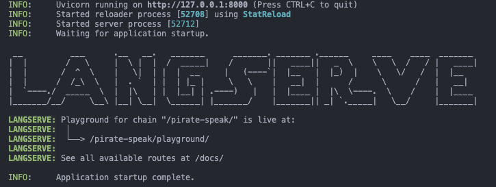

# LangChain 0.1.0 (MacBook M1/2 - macOS 14) Setup Guide

The [README](../README.md) for langchain is a great place to start, but I ran into some issues getting started, and wanted to document the steps I took to get a working environment.

## Table of Contents

- [LangChain 0.1.0 (MacBook M1/2 - macOS 14) Setup Guide](#langchain-010-macbook-m12---macos-14-setup-guide)
  - [Table of Contents](#table-of-contents)
  - [Introduction](#introduction)
  - [Prerequisites](#prerequisites)
    - [Install Xcode Command Line Tools, Homebrew, and Pyenv](#install-xcode-command-line-tools-homebrew-and-pyenv)
    - [Install and Configure Pyenv](#install-and-configure-pyenv)
    - [Install Python versions](#install-python-versions)
    - [Install LangChain, LangChain-CLI, and Pydantic](#install-langchain-langchain-cli-and-pydantic)
    - [Creating a new app](#creating-a-new-app)
    - [Adding Templates](#adding-templates)
    - [Fixing Template Dependencies](#fixing-template-dependencies)
    - [Setting Up Environment Variables](#setting-up-environment-variables)
    - [Running the app](#running-the-app)
    - [SUCCESS!](#success)
    - [Bonus:](#bonus)
    - [Bonus 2:](#bonus-2)
- [Conclusion](#conclusion)

## Introduction

After having some issues getting builds to work and installing Python `>=3.12.1`, I have documented the steps I took to create a repeatable stable working environment for developing with langchain. If you are not using langchain, but are having issues installing Python `>=3.12.1` with `Pyenv`, the beginning of this guide may also help you.

## Prerequisites

First, it’s always good to go ahead and make sure you’re running the latest macOS version. At the time of writing, this is macOS 14.2.1.

To start, there are a few prerequisites that must be installed:

---

1. Xcode Command Line Tools
2. Homebrew
3. Pyenv

---

### Install Xcode Command Line Tools, Homebrew, and Pyenv

Pyenv has a page for [configuring a recommended build environment](https://github.com/pyenv/pyenv/wiki#suggested-build-environment), which I have found to work **nearly** flawlessly.

While these steps worked perfectly for me to install Pyenv and install Python versions `<3.12.1`, there seems to be some dependency issues with 3.12.1+, namely `ncurses`.

To fix this, a slight modification to the above link's installation list is needed.
This may get fixed in later versions of Pyenv, but for now, you can add it to the list of dependencies:

```shell
brew install openssl readline sqlite3 xz zlib tcl-tk ncurses
```

<br />

If you are here because you already have `Pyenv` installed, but can't install Python versions `>=3.12.1`, you can try installing `ncurses` with:

```shell
brew install ncurses
```

<br />

---

### Install and Configure Pyenv

Next, make sure Homebrew is up to date and install Pyenv:

```shell
brew update
brew install pyenv
```

After installing Pyenv, you may need to [setup your shell environment](https://github.com/pyenv/pyenv/?tab=readme-ov-file#set-up-your-shell-environment-for-pyenv).

You can verify this by checking your `~/.bashrc` or `~/.zprofile`, for these lines:

```shell
export PYENV_ROOT="$HOME/.pyenv"
command -v pyenv >/dev/null || export PATH="$PYENV_ROOT/bin:$PATH"
eval "$(pyenv init -)"
```

If you do not have these lines, follow the instructions from the link above to add them to your shell environment.

> You **must** do this before continuing.

Restart your terminal, and verify that pyenv is installed:

```shell
pyenv --version
```

You should see something like:

```shell
pyenv 2.3.35
```

---

### Install Python versions

Now you should be able to install any Python version you want!

Try running:

```shell
pyenv install 3.12.1
```

After a few minutes, you should have python installed and can set it globally with:

```shell
pyenv global 3.12.1
```

For those of you reading this for only Pyenv help, you should be good to go!

The rest of this guide is for installing langchain and getting started with it.

<br />

---

### Install LangChain, LangChain-CLI, and Pydantic

Now here is where I needed to experiment for different levels of stability.

Since langchain released `v0.1.0` recently, there are some outdated docs and templates used within those docs.
Here is what I found to work best, using the same tooling langchain uses under the hood.

Using the **global** Python version, install the main dependencies and cli:

```shell
pip install langchain langchain-cli "pydantic==1.*"
```

Since there is a long timeline on a full pedantic 2 migration, and since langchain uses v1 under the hood, we will too.

I know langhchain has used the `v1` namespace for `v2`, but downstream dependencies seem much happier with global pydantic `<v2`. The full Pydantic migration guide can be found [here](https://docs.pydantic.dev/latest/migration/#continue-using-pydantic-v1-features).

With those globally installed, we’re ready to get started!

---

### Creating a new app

(Optional) Create a new directory you want to work under, for example:

```shell
mkdir ~/langchain-projects

cd ~/langchain-projects
```

Now create a new empty app using langchain-cli
(replace your-app-name with whatever you want your app/project to be called):

```shell
langchain app new your-app-name
```

And navigate into the app directory:

```shell
cd your-app-name
```

---

### Adding Templates

LangChain has an excellent [README](https://github.com/langchain-ai/langchain/blob/master/templates/README.md) for a basic app quickstart, which walks us through creating an app and adding a `pirate-speak` template.

Unfortunatly it also has some dependency issues/mismatches, so lets see how we can fix them.

If we were to simply add the new template to our app, we would install the template as a globally installed dependency. If you work on multiple apps, this may not be ideal. Let's use a virtual environment instead, and staying consistent with langchain tooling, we will use `poetry`.

If you do not have poetry installed, you can install it with:

```shell
pip install poetry
```

Now we can create a new virtual environment for our app, and install the dependencies:

```shell
poetry install
```

We can easily activate our virtual environment with:

```shell
poetry shell
```

---

<br />

If you are using VSCode, you can activate the interpreter by copying the output of running:

```shell
poetry env info --path
```

Using the Developer Tools (`CMD + Shift + P`), search for `Python: Select Interpreter`


and select `Enter interpreter path...`


Now paste in the path to the virtual environment:


paste the path to the virtual environment:
`

and hit Enter.

You should now see the virtual environment in the bottom right/left corner of VSCode.

**You are finally ready to start adding templates!**

---

<br />

Following along with the quickstart, we can jump ahead to adding the `pirate-speak` template:

```shell
langchain app add pirate-speak
```

This will add the template to your app, and install the dependencies.
When asked if you want to install it editable, say yes:

```shell
Would you like to `pip install -e` the template(s)? [y/n]: y
```

Following the instructions in the console, and continuing along with the quickstart:

> To use this template, add the following to your app:

```shell
from pirate_speak.chain import chain as pirate_speak_chain

add_routes(app, pirate_speak_chain, path="/pirate-speak")
```

we can update our `/app/server.py` file from this:

```python
from fastapi import FastAPI
from fastapi.responses import RedirectResponse
from langserve import add_routes

app = FastAPI()


@app.get("/")
async def redirect_root_to_docs():
    return RedirectResponse("/docs")


# Edit this to add the chain you want to add
add_routes(app, NotImplemented)

if __name__ == "__main__":
    import uvicorn

    uvicorn.run(app, host="0.0.0.0", port=8000)
```

to this:

```python
from fastapi import FastAPI
from fastapi.responses import RedirectResponse
from langserve import add_routes

# import chains
from pirate_speak.chain import chain as pirate_speak_chain

# create FastAPI app
app = FastAPI()

# add chains to app as routes
add_routes(app, pirate_speak_chain, path="/pirate-speak")

# redirect root to docs
@app.get("/")
async def redirect_root_to_docs():
    return RedirectResponse("/docs")

if __name__ == "__main__":
    import uvicorn

    uvicorn.run(app, host="0.0.0.0", port=8000)
```

---

### Fixing Template Dependencies

This template uses `langchain-community` and `langchain-core` as dependencies, but they are currently using versions that are incompatible with the latest `langchain` release. To fix this, we can update the `pyproject.toml` file to remove these dependencies, and let the template use the global dependencies instead.

```toml
[tool.poetry]
name = "pirate-speak"
version = "0.0.1"
description = "Get started with a simple template that speaks like a pirate"
authors = []
readme = "README.md"

[tool.poetry.dependencies]
python = ">=3.8.1,<4.0"
openai = "<2"
# langchain-community = "^0.0.7" // comment out these lines
# langchain-core = "^0.1.4"      // or remove them entirely

# rest of file
...
```

Now we need to delete the `poetry.lock` file, and re-install the dependencies:

```shell
rm poetry.lock
rm packages/pirate-speak/poetry.lock

poetry install
```

We can verify that the dependencies are installed correctly by running:

```shell
poetry show
```

You should see something like:


Next, we need to install the new version of langchain's openai package, since the one from `langchain-community` is outdated:

```shell
poetry add langchain-openai
```

Now we need to update the `pirate_speak/chain.py` file to use the new OpenAI import:

```python
from langchain_community.chat_models import ChatOpenAI # remove this top line
from langchain_openai import ChatOpenAI # and replace it with this line

... # rest of file
```

---

### Setting Up Environment Variables

The quickstart uses hardcoded environment variables, which is not ideal for production apps.
We can easily map these to environment variables using the `python-decouple` package. Install it with:

```shell
poetry add python-decouple
```

For this example using `pirate-speak`, we will need to add the `OPENAI_API_KEY` to the default ChatGPT runnable.
Update the `/packages/pirate-speak/pirate_speak/chain.py` file to use the new environment variable:

```python
from langchain_openai import ChatOpenAI
from langchain_core.prompts import ChatPromptTemplate
from decouple import config # add this line

_prompt = ChatPromptTemplate.from_messages(
    [
        (
            "system",
            "Translate user input into pirate speak",
        ),
        ("human", "{text}"),
    ]
)
_model = ChatOpenAI(api_key=config("OPENAI_API_KEY")) # and add the api key here

# if you update this, you MUST also update ../pyproject.toml
# with the new `tool.langserve.export_attr`
chain = _prompt | _model
```

> (Optional) IF you have access to Langsmith, you can also add the `LANGCHAIN_TRACING_V2`, `LANGCHAIN_ENDPOINT`, `LANGCHAIN_API_KEY`, and `LANGCHAIN_PROJECT` environment variables to the app.

You can do this by updating the `/app/server.py` file to map the environment variables using `python-decouple` and adding them to the `os.environ`:

```python
import os # add this line
from fastapi import FastAPI
from fastapi.responses import RedirectResponse
from langserve import add_routes
from decouple import config # add this line

# import chains from packages
from pirate_speak.chain import chain as pirate_speak_chain

# setup langsmith env vars
for env_var in [
    "LANGCHAIN_TRACING_V2",
    "LANGCHAIN_ENDPOINT",
    "LANGCHAIN_API_KEY",
    "LANGCHAIN_PROJECT",
]:
    os.environ[env_var] = config(env_var)

# setup fastapi app
app = FastAPI()

# add routes for each chain
add_routes(app, pirate_speak_chain, path="/pirate-speak")

@app.get("/")
async def redirect_root_to_docs():
    return RedirectResponse("/docs")

if _name_ == "_main_":
    import uvicorn
    uvicorn.run(app, host="0.0.0.0", port=8000)
```

Now we can create a `.env` file in the root of our app, and add the environment variables:

```shell
touch .env

# Add the .env to your .gitignore!
echo ".env" >> .gitignore
```

```shell
# .env
OPENAI_API_KEY=your-openai-api-key
LANGCHAIN_TRACING_V2=true
LANGCHAIN_ENDPOINT=https://api.smith.langchain.com
LANGCHAIN_API_KEY=your-langsmith-api-key
LANGCHAIN_PROJECT=your-app-name # optional (default is "default")
```

---

### Running the app

Now we can run the app with:

```shell
langchain serve
```

if all goes well, you should see something like:



### SUCCESS!

navigate to `http://localhost:8000/docs` to see the docs!
or `http://localhost:8000/pirate-speak/playground` to test out the pirate speak chat!

---

### Bonus:

IF youn have made it this far, AND love docker (or will be deploying to a docker environment), you can additionally update the `Dockerfile` to use the `python:3.12.1` image:

```dockerfile
FROM python:3.12.1 # update this line to match your python version (or deployment version)

... # rest of file stays the same
```

you can now create a docker compose file to run the app:

```yaml
version: '3'
services:
  myapp:
    build:
      context: .
      dockerfile: Dockerfile
    ports:
      - '8080:8080'
    env_file:
      - .env
```

and run it with:

```shell
docker compose up --build
```

You can now develop locally, and develop your docker setup with ease!

<br />

---

### Bonus 2:

Now that you have a working app, you should probably hook up version control.

```shell
git init
```

# Conclusion

The people at langchain have done an amazing job with the tooling, but things move fast and break. Hopefully this guide will help you get started with langchain, and help you avoid some of the pitfalls I ran into.
